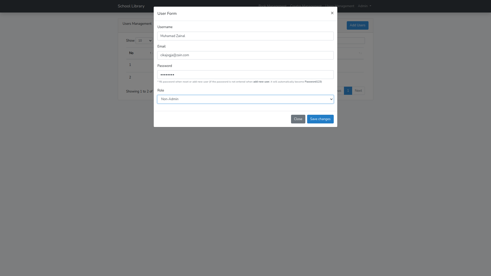

# School Library

<p align="center">
  <a href="https://laravel.com/">
    
  </a>
</p>

> Simple application for managing book and book creator (CRUD) using Laravel and Bootstrap

> This system must have User Level Admin and Non-Admin with Login, Logout, and reset password functions. **Admin can add Non-Admin users**, but **non-admin can not get users**.When adding or changing Book information, **Admin must be able to select Book Author**. in this case i use many to many relationship (because books can has more than one author)

---

## Table of contents

-   [Table of contents](#table-of-contents)
-   [Prerequiste](#prerequiste)
-   [Tools](#tools)
-   [Stacks](#stacks)
-   [Installation and Cofiguration](#installation)
-   [Screen Capture](#capture)
    -   [Authentication](#authentication)
    -   [Home](#home)
    -   [Manage Author](#manage-author)
    -   [Manage Book](#manage-book)
    -   [User Page List](#users-list-page)

## Prerequiste

-   [Composer](https://getcomposer.org/) - Download and Install Composer
-   Minimum PHP7.4.3
-   MySQL

## Tools

-   Terminal (OhMyZSH)
-   Code Editor : Visual Studio Code
-   Web Server : Apache
-   Database Server : MySQL
-   GUI Database Management : DBeaver

## Stacks

-   PHP 7.4.3 (Because my OS does not support PHP 8) - old linux
-   Laravel 8 (Because my OS does not support PHP 8) - old linux
-   Bootstrap 4.6.0
-   Toastr
-   Sweetalert
-   Select2
-   DataTables
-   MySQL

## Installation

1. Clone repository

```bash
$ git clone https://github.com/Zainal21/School-library-apps.git
```

2. move to directory project and Install depedencies

```bash

$ cd school-library-apps

$ Composer install
```

3. Setup your environment variabl in `.env` files or rename `.env.example to .env`.

4. Generate your application key

```bash
$ php artisan key:generate
```

5. Run Migration and Seeder (if you not import .sql file manually)

```bash
$ php artisan migrate --seed
```

6. Run Development server

```bash
$ php artisan serve
```

## Screen Capture Result

### Authentication

-   Login
    
-   Register
    
-   Reset Password
    

### Home

-   Home (Admin)
    
-   Home (Non-Admin)
    

### Manage Book Creator

-   Creator Manage Page
    

-   Modal Form
    

### Manage Books page

-   Books Manage Page
    

-   Modal Form
    

### Users list Page

-   User list page (Admin Only)
    

-   Modal Form
    

---

Copyright © 2022 by Muhamad Zainal Arifin

> The Project is Under MIT licensed.
